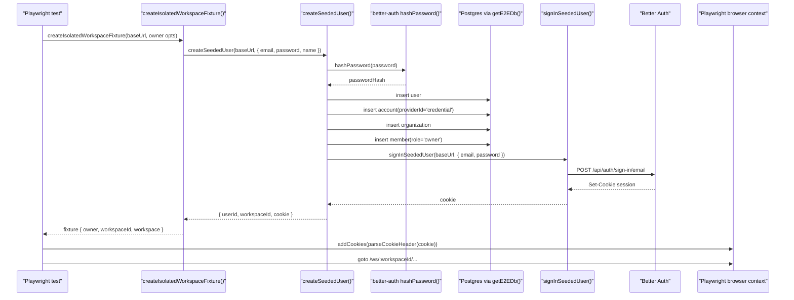
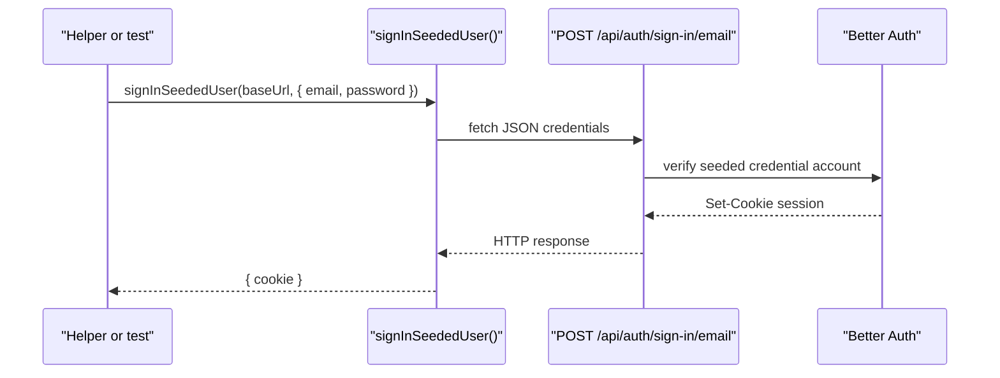
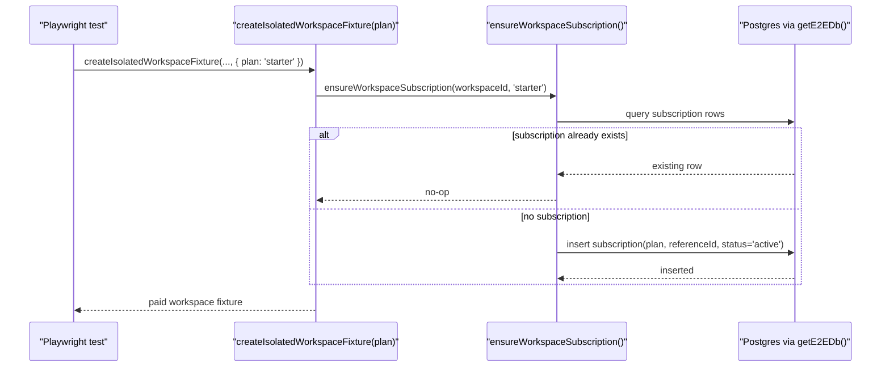
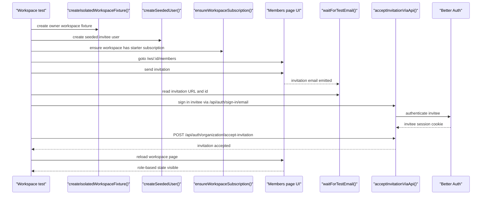

# E2E Seeded Auth And Workspace Fixtures

This note explains how the seeded E2E helpers work today in `apps/web` and `packages/test-utils`.

Key files:

- [`packages/test-utils/src/e2e-auth.ts`](/Users/sfung/.codex/worktrees/a718/sass-starter-template/packages/test-utils/src/e2e-auth.ts)
- [`packages/test-utils/src/seeded-user.ts`](/Users/sfung/.codex/worktrees/a718/sass-starter-template/packages/test-utils/src/seeded-user.ts)
- [`packages/test-utils/src/isolated-workspace.ts`](/Users/sfung/.codex/worktrees/a718/sass-starter-template/packages/test-utils/src/isolated-workspace.ts)
- [`packages/test-utils/src/e2e-db.ts`](/Users/sfung/.codex/worktrees/a718/sass-starter-template/packages/test-utils/src/e2e-db.ts)
- [`apps/web/test/e2e/workspace/settings.spec.ts`](/Users/sfung/.codex/worktrees/a718/sass-starter-template/apps/web/test/e2e/workspace/settings.spec.ts)
- [`apps/web/test/e2e/workspace/members.spec.ts`](/Users/sfung/.codex/worktrees/a718/sass-starter-template/apps/web/test/e2e/workspace/members.spec.ts)

## Main Idea

The helpers seed durable auth/workspace rows directly in Postgres, but they still ask Better Auth to issue the real session cookie. That keeps tests fast without hardcoding session internals.

For non-billing workspace flows, paid entitlements can also be seeded directly by inserting a `subscription` row. Live Stripe checkout remains covered in `billing.spec.ts`, where billing behavior itself is under test.

## Normal Isolated Workspace Flow

## `signInSeededUser()` Flow

## Paid Workspace Extension

This is used when a test needs paid-plan behavior but is not testing checkout itself.

## Invite Flow In Members Or Settings Tests

## Practical Rules

- Use `createIsolatedWorkspaceFixture()` when a test needs a private workspace.
- Use `createIsolatedWorkspaceFixture({ plan: 'starter' | 'pro' })` when a non-billing spec needs paid entitlements.
- Use `createSeededUser()` for additional users that should exist without real sign-up.
- Use `signInSeededUser()` when you want Better Auth to mint a real session cookie from seeded credentials.
- Keep live Stripe checkout in billing-focused tests rather than using it as generic workspace setup.
