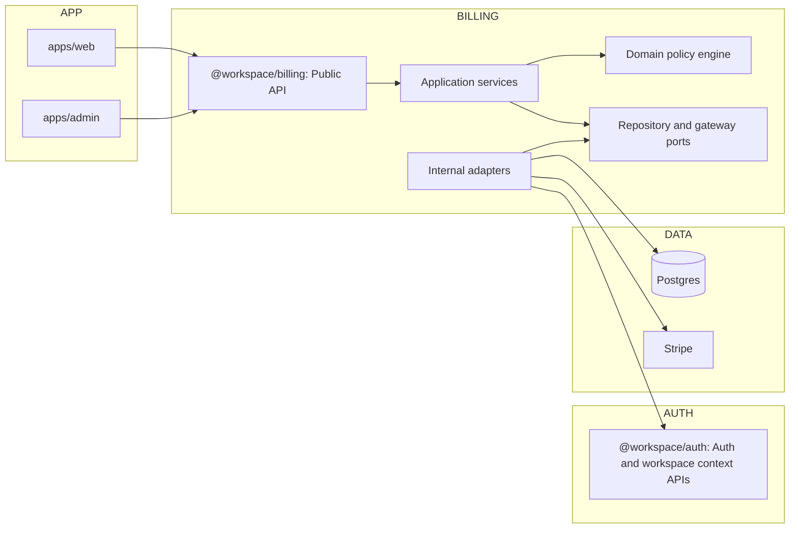
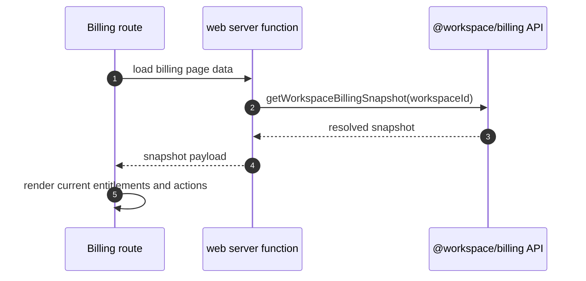
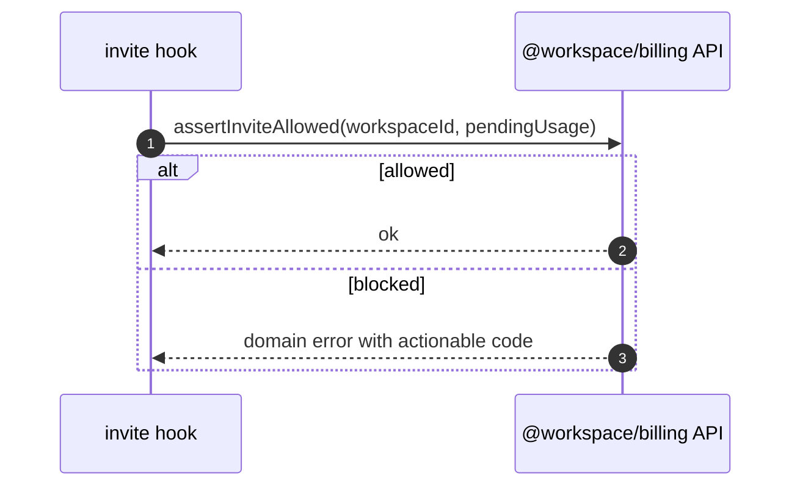
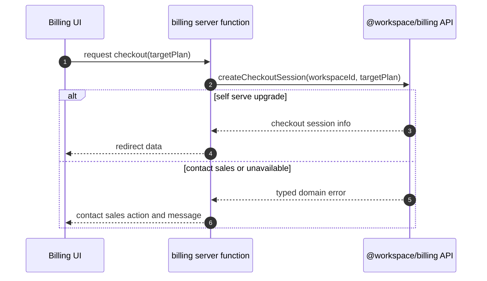

# Enterprise Billing and Entitlement Modular Architecture

**Status:** `[ ] Planned [ ] In Progress [x] Completed`  
**Date:** 2026-04-03  
**Goal:** Create a long-term, low-coupling billing and entitlement architecture where application layers depend only on domain contracts, never directly on billing tables or Stripe primitives.

**Cross-links:**

- [Specification](../superpowers/specs/2026-04-03-enterprise-billing-modular-architecture-spec.md)
- [Execution plan](../superpowers/plans/2026-04-03-enterprise-billing-modular-architecture.md)
- [Original entitlements plan](../superpowers/plans/2026-04-01-enterprise-entitlements.md)
- [Original entitlements design](../superpowers/specs/2026-04-01-enterprise-entitlements-design.md)

## 1. Why this rewrite exists

The previous branch drifted because policy, storage, and UI concerns were mixed:

- app code read and wrote override tables directly,
- entitlement checks were duplicated in multiple server paths,
- checkout eligibility was inferred from plan identity instead of a formal action policy,
- and UI relied on partial payloads and fallback assumptions.

This design removes those failure modes with strict boundaries and explicit APIs.

## 2. Architecture principles

1. **Single enforcement model.** Every limit and feature check runs through one billing domain policy surface.
2. **No app-to-table coupling.** `apps/web` and `apps/admin` cannot read or write billing tables.
3. **No checkout inference.** Plan transitions are represented by explicit action types.
4. **Server authority.** UI renders from a resolved workspace billing snapshot.
5. **Contract-first evolution.** Domain APIs are stable; internals can change freely.

## 2.1 Drift prevention guardrails

The following controls are part of the architecture, not optional process notes:

1. **Fitness function: forbidden imports.** CI fails if `apps/web` or `apps/admin` imports billing tables or internal billing adapter modules.
2. **Fitness function: one-way dependency flow.** CI fails if `@workspace/billing` imports app modules, or if apps import `@workspace/billing/infrastructure/*`.
3. **Contract gate for payloads.** `WorkspaceBillingSnapshot` is schema-validated in server responses and fixture builders; tests fail on missing required fields.
4. **Single-policy gate.** Invite/member/feature enforcement call only billing policy APIs (`assert*` methods). Ad-hoc checks against raw plan IDs are forbidden.
5. **Contract change protocol.** Any public API/type change in `@workspace/billing` requires same-PR updates to:
   - design/spec/plan docs,
   - package contract tests,
   - impacted app callsites and fixtures.
6. **Delete-legacy rule.** During each slice migration, remove replaced helpers in the same PR to avoid dual-path drift.

## 3. Module boundaries

### Boundary rules

- `apps/web` imports only `@workspace/billing` public exports.
- `apps/admin` imports only `@workspace/billing` public exports.
- Table-level access for overrides and subscriptions lives in billing internal adapters.
- `@workspace/auth` provides auth/session/workspace context and subscription identity APIs; it does not own entitlement math.

## 4. Public contracts

This is the only API surface application code can use.

### 4.1 Queries

- `getWorkspaceBillingSnapshot(input): Promise<WorkspaceBillingSnapshot>`
  - Inputs: `workspaceId`, `actor`, optional consistency options.
  - Output includes:
    - `currentPlanId`
    - `subscriptionState`
    - `currentEntitlements` (fully resolved)
    - `catalogPlans`
    - `targetActionsByPlan` (`current | upgrade | downgrade | cancel | contact_sales | unavailable`)

- `getWorkspaceEntitlements(input): Promise<Entitlements>`
- `previewPlanChange(input): Promise<PlanChangePreview>`
- `getWorkspaceEntitlementOverrides(input): Promise<EntitlementOverrides | null>`

### 4.2 Commands

- `setWorkspaceEntitlementOverrides(input): Promise<OverrideWriteResult>`
- `clearWorkspaceEntitlementOverrides(input): Promise<OverrideWriteResult>`
- `createCheckoutSession(input): Promise<CheckoutResult>`
  - Fails with structured domain error when target action is not `upgrade` self-serve.

### 4.3 Policy checks

- `assertWorkspaceLimit(input): Promise<void | DomainError>`
- `assertWorkspaceFeature(input): Promise<void | DomainError>`
- `assertInviteAllowed(input): Promise<void | DomainError>`

All server enforcement paths call these policies; no ad-hoc plan checks are allowed.

## 5. Domain model

### 5.1 Entitlements

- `limits: Record<LimitKey, number>` where `-1` means unlimited.
- `features: Record<FeatureKey, boolean>`
- `quotas: Record<QuotaKey, number>` where `-1` means unlimited.

Keys:

- `LimitKey`: `members | projects | apiKeys`
- `FeatureKey`: `sso | auditLogs | apiAccess | prioritySupport`
- `QuotaKey`: `storageGb | apiCallsMonthly`

### 5.2 Overrides

- `EntitlementOverrides` is partial for each domain.
- Missing key means inherit.
- `features[key] = false` is explicit force-off, not inherit.
- Numerics support explicit unlimited via `-1`.

### 5.3 Plan actions

`PlanAction = current | upgrade | downgrade | cancel | contact_sales | unavailable`

The action model is authoritative for:

- checkout eligibility,
- billing CTA rendering,
- and downgrade confirmation behavior.

## 6. Runtime flows

### 6.1 Billing page render

### 6.2 Invite enforcement

### 6.3 Enterprise checkout guard

## 7. Admin ownership model

Admin stays a client of domain contracts:

- form state handles tri-state and unlimited semantics,
- serialization sends partial patches only,
- persistence is delegated to `setWorkspaceEntitlementOverrides` and `clearWorkspaceEntitlementOverrides`.

Admin never imports schema tables and never composes entitlement logic.

## 8. Internal package structure

Inside `@workspace/billing`:

- `contracts/` public types and API interfaces.
- `domain/` pure policy logic (`resolveEntitlements`, checks, diff).
- `application/` use cases (`getWorkspaceBillingSnapshot`, `createCheckoutSession`).
- `infrastructure/` adapters implementing ports (db, stripe, auth-context).

Only `contracts` and approved application functions are exported from package root.

## 9. Migration strategy

### Phase 1: Contract gate

- Finalize public APIs and domain error model.
- Add lint/dep rule blocking `apps/*` imports of billing tables.

### Phase 2: Server cutover

- Migrate invite checks, billing page loaders, and checkout handlers to billing APIs.
- Remove plan-constant checks from app code.

### Phase 3: Admin cutover

- Migrate admin override read/write flows to billing APIs.
- Delete direct table imports and query code from admin server modules.

### Phase 4: Cleanup

- Remove legacy helpers and duplicate entitlement logic.
- Keep one resolver and one action engine.

## 10. Non-goals

- Workspace RBAC redesign and CASL integration.
- Reworking identity provider responsibilities in `@workspace/auth`.
- Introducing backward-compatibility facades for deprecated APIs.

## 11. Definition of done

1. `apps/web` and `apps/admin` contain zero imports of billing override/subscription tables.
2. Every limit/feature enforcement path calls billing policy APIs.
3. Enterprise targets never attempt checkout in server or client paths.
4. Billing UI always renders from `WorkspaceBillingSnapshot.currentEntitlements`.
5. Admin override UX round-trips inherit/true/false and numeric inherit/value/unlimited.
6. Test suite includes boundary tests that fail if app-layer direct DB coupling is reintroduced.
7. Drift-prevention fitness checks are enabled in CI and enforced as required checks.

## Appendix A. Migration diff (priority order)

This appendix lists the concrete files to migrate first, in execution order, to eliminate coupling with billing tables and stabilize the contract rollout.

### A1. Priority 0 (foundation contract and guards)

| Priority | File                                      | Current direct coupling                     | Target state                                                                            |
| -------- | ----------------------------------------- | ------------------------------------------- | --------------------------------------------------------------------------------------- |
| P0       | `@workspace/billing` package root exports | No centralized app-facing contract yet.     | Publish query, command, and policy APIs from one root surface.                          |
| P0       | Repo lint/dependency rules                | App layers can still import billing tables. | Add forbidden-import rules so `apps/web` and `apps/admin` cannot import billing tables. |

### A2. Priority 1 (highest-risk runtime paths)

| Priority | File                                     | Current direct coupling                                                                                   | Replace with                                                                                                      |
| -------- | ---------------------------------------- | --------------------------------------------------------------------------------------------------------- | ----------------------------------------------------------------------------------------------------------------- |
| P1       | `apps/web/src/billing/billing.server.ts` | Imports `workspaceEntitlementOverrides` and reads override rows directly.                                 | `getWorkspaceBillingSnapshot`, `getWorkspaceEntitlements`, and `createCheckoutSession` from `@workspace/billing`. |
| P1       | `packages/auth/src/auth.server.ts`       | `beforeCreateInvitation` reads `workspaceEntitlementOverrides` directly and resolves entitlements inline. | `assertInviteAllowed` policy call from `@workspace/billing` with typed error handling.                            |

### A3. Priority 2 (admin cutover to contract-only integration)

| Priority | File                                        | Current direct coupling                                                                                                        | Replace with                                                                                                                        |
| -------- | ------------------------------------------- | ------------------------------------------------------------------------------------------------------------------------------ | ----------------------------------------------------------------------------------------------------------------------------------- |
| P2       | `apps/admin/src/admin/workspaces.server.ts` | Imports `workspaceEntitlementOverrides` and `subscription` tables; performs override CRUD and subscription reads in app layer. | Admin-oriented billing queries/commands from `@workspace/billing` (workspace detail snapshot, list summaries, set/clear overrides). |

### A4. Priority 3 (test harness migration)

| Priority | File                                                   | Change needed                                                                                       |
| -------- | ------------------------------------------------------ | --------------------------------------------------------------------------------------------------- |
| P3       | `apps/web/test/unit/billing/billing.server.test.ts`    | Stop mocking direct override-table queries; mock billing contract calls and typed domain results.   |
| P3       | `apps/admin/test/unit/admin/workspaces.server.test.ts` | Replace DB-table expectations with billing API contract expectations.                               |
| P3       | `packages/auth/test/unit/auth.server.test.ts`          | Replace inline override row mocking in invite hook tests with `assertInviteAllowed` behavior tests. |

### A5. Priority 4 (deletion pass)

After P1-P3 are green:

1. Delete app-layer helper code that converts DB override rows to entitlement overrides.
2. Delete direct table imports for overrides/subscriptions from `apps/web` and `apps/admin`.
3. Keep storage ownership inside billing infrastructure adapters only.

### A6. Exit checks for this appendix

1. `rg -n "workspaceEntitlementOverrides|subscription as subscriptionTable" apps/web apps/admin` returns no billing-table imports from app layers.
2. Invite enforcement code path does not perform inline entitlement resolution from DB rows.
3. Billing and admin tests pass while mocking only billing contract APIs at application boundaries.
