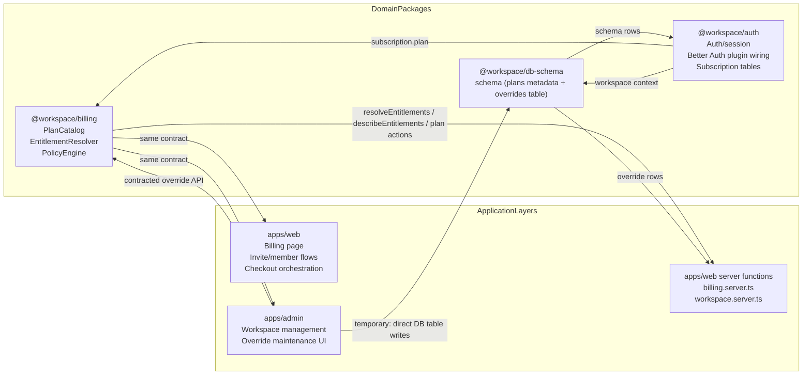
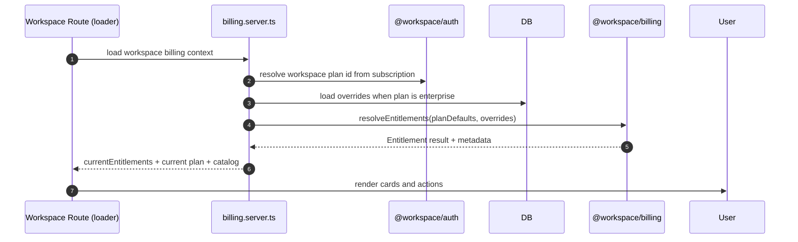
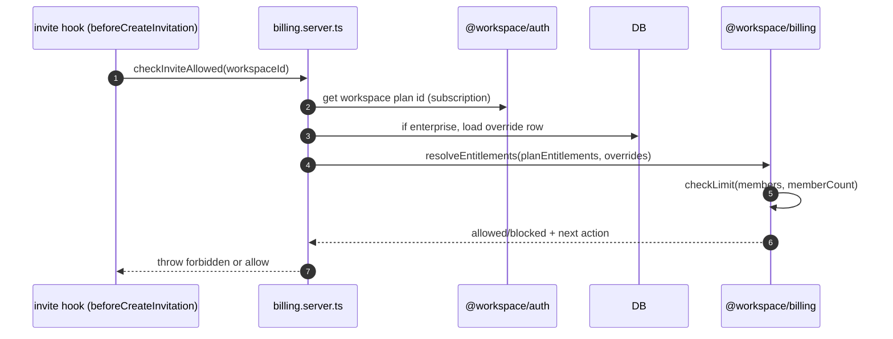
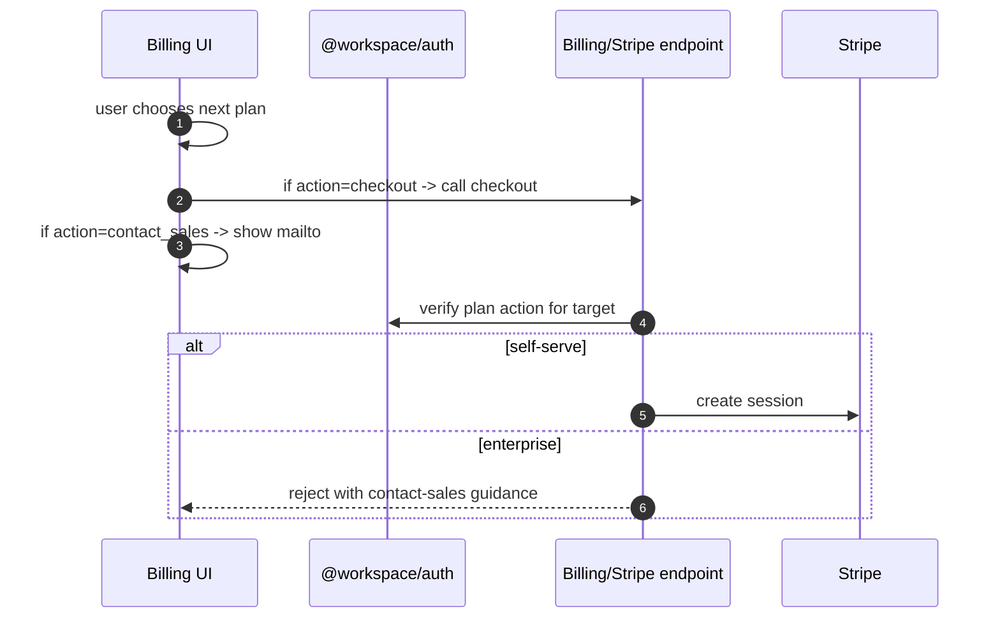

# Enterprise Billing & Entitlement Architecture (Modular Migration)

**Status:** `[ ] Planned [x] In Progress [ ] Completed`  
**Next Action:** Finalize domain package ownership and begin server-level migration.  
**Date:** 2026-04-03
**Goal:** Rebuild the billing/payment/entitlement stack as explicit domains with a small, stable contract surface and no hidden coupling between auth, billing UI, and admin flows.

**Revision Log:**

- 2026-04-03 (owner: design) — Added initial architecture and checkpoint framework.
- 2026-04-03 (owner: design) — Fixed Mermaid compatibility and execution evidence.
- 2026-04-03 (owner: design) — Added DoD tables, status tags, revision log, and cross-document linkage.

**Cross-links:**

- [Specification](../superpowers/specs/2026-04-03-enterprise-billing-modular-architecture-spec.md)
- [Execution plan](../superpowers/plans/2026-04-03-enterprise-billing-modular-architecture.md)
- [Original entitlements plan](../superpowers/plans/2026-04-01-enterprise-entitlements.md)
- [Original entitlements design](../superpowers/specs/2026-04-01-enterprise-entitlements-design.md)

## Execution checkpoints

- [ ] Capture canonical API contracts for entitlement resolver, plan actions, and effective workspace entitlements.
- [ ] Reconcile all billing enforcement and checkout decisions to the action model.
- [ ] Remove implicit plan fallback assumptions from UI and server payloads.
- [ ] Implement and verify enterprise contact-sales behavior without checkout fallback.
- [ ] Validate admin override tri-state behavior and explicit serialization semantics.
- [ ] Close loop on accessibility regressions introduced by mixed button/link render patterns.

### Checkpoint Evidence

| Checkpoint                | Owner                  | Validation signal                                                                                 |
| ------------------------- | ---------------------- | ------------------------------------------------------------------------------------------------- |
| API contracts             | billing domain owner   | Domain package exports and test coverage exist for entitlements, actions, and limits.             |
| Enforcement/action model  | billing + web owner    | `checkout` paths never execute for enterprise actions; plan matrix unit tests cover transitions.  |
| Payload correctness       | web backend owner      | Billing loaders return `currentEntitlements` and tests fail on missing payload field.             |
| Contact-sales behavior    | product/checkout owner | Manual and automated test cases confirm contact link opens only for enterprise target.            |
| Admin override semantics  | admin owner            | Form tests include inherit, explicit true/false, and explicit unlimited cases.                    |
| Accessibility regressions | UI owner               | Button/link render tests include no `nativeButton` warnings and snapshot or strict output checks. |

### Definition of Done

| Checkpoint                | Test / gate                                                                                                                                       | Done when                                                                                                               |
| ------------------------- | ------------------------------------------------------------------------------------------------------------------------------------------------- | ----------------------------------------------------------------------------------------------------------------------- |
| API contracts             | `pnpm --filter @workspace/auth test packages/auth/test/unit/entitlements.test.ts` (or equivalent domain package path)                             | All contract tests pass and no direct plan-ID limit reads remain in web/auth enforcement code.                          |
| Billing enforcement model | `pnpm --filter @workspace/web test test/unit/billing/billing.functions.test.ts`                                                                   | Enterprise plan branch never calls checkout and returns `contact_sales` action/model.                                   |
| Payload correctness       | `pnpm --filter @workspace/web test test/integration/components/billing/billing-upgrade-flow.integration.test.tsx`                                 | Integration fixture uses resolved entitlements; missing entitlements cause deterministic, intentional failure handling. |
| Contact-sales behavior    | `pnpm --filter @workspace/web test test/unit/components/billing/billing-plan-cards.test.tsx`                                                      | Card and prompt render a link-based `Contact Sales` interaction for enterprise and no checkout CTA.                     |
| Admin override semantics  | `pnpm --filter @workspace/admin test apps/admin/test/unit/admin/workspaces.functions.test.ts`                                                     | Tri-state and unlimited cases persist only explicit override keys; inherited keys are omitted.                          |
| Accessibility regressions | `pnpm --filter @workspace/web test test/unit/components/billing` and `pnpm --filter @workspace/admin test test/unit/components/nav-user.test.tsx` | No Base UI `nativeButton` misuse warnings for anchor link actions.                                                      |

## 1) Why this document now

The current implementation evolved through incremental fixes and has drifted across:

- `packages/auth` (plan definitions + subscription helpers),
- `apps/web` billing pages and hooks,
- Admin override pages, and
- auth hooks for invitation/invite enforcement.

This has produced repeated regressions because the boundaries were implicit and partial contracts leaked through UI and server layers.

This document defines a **clean modular architecture**: one domain package owns policy and entitlement resolution, while web apps depend on that contract as read-only input.

## 2) Design principles

1. **Single source of truth for entitlement semantics.**  
   All checks (`limits`, `features`, `quotas`) use `resolveWorkspaceEntitlements()` + `checkLimit()`/`hasFeature()` from one module.

2. **Plan identity and entitlement math are not the same.**  
   Stripe plan pricing/state determines **billing state**; entitlements determine **effective workspace capability**.

3. **Overrides are additive, partial, and explicit.**  
   `{}` means inherit plan defaults; any key present in an override object is authoritative.

4. **No RBAC in this phase.**  
   Workspace admin/member authorization is out of scope for this billing rewrite, per decision. We keep role checks where they already live.

5. **Server is authoritative.**  
   UI can render best-effort suggestions, but enforcement always happens in server code paths before commit/write.

## 3) Module boundaries and public contracts

> In the target architecture, admin override CRUD is routed through `@workspace/billing` only; the direct `apps/admin -> @workspace/db-schema` edge is temporary and removed during migration.

### 3.1 `@workspace/billing` (new)

- `getWorkspaceEntitlements(workspaceId, db, headers)`  
  Resolves the effective entitlements for one workspace.
- `resolveEntitlements(planEntitlements, overrides)`  
  Pure merge of plan defaults + explicit overrides.
- `checkWorkspaceLimit(ctx)`  
  Checks `members`, `projects`, `workspaces`, `apiKeys` against current usage.
- `checkWorkspaceFeature(ctx)`  
  Feature gate checks for `sso`, `auditLogs`, etc.
- `computeEntitlementDiff(current, target)`  
  Returns changed numeric and boolean keys for UI.
- `getWorkspacePlanAction(fromPlan, toPlan)`  
  Returns `upgrade | downgrade | cancel | current | contact_sales`.
- `describeEntitlements(entitlements)`  
  UI-friendly formatter for feature/limit/quota lines.

### 3.2 `@workspace/auth` responsibilities

- Keep this package focused on identity and session/workspace ownership, Better Auth plugin hooks, and webhook plumbing.
- Provide helpers that are narrow and domain-aligned:
  - subscription lookup (workspace-scoped)
  - subscription plan id resolution
  - plan ↔ price map wiring for Stripe (`priceToPlanMap`, `stripePlans`)
- Expose only what is needed by `@workspace/billing`; do not re-implement entitlement math.

### 3.3 `apps/web` server boundary

- `apps/web/src/billing/billing.server.ts` owns all outbound calls to `@workspace/billing` and DB reads.
- Billing UI components receive fully resolved data (`current plan`, `currentEntitlements`, `plan catalog`) and stay presentational.
- Invite/member flows call a single helper:
  - `beforeCreateInvitation` policy check from a shared `checkWorkspaceEntitlementLimit` path.

### 3.4 `apps/admin` domain

- Admin writes only override data and metadata notes.
- Admin never infers payment behavior.
- UI only handles tri-state interpretation (omit / false / true for features, blank / value / unlimited for numerics) and converts form state into resolver-safe payloads.

## 4) Data model and DB contract

### 4.1 Canonical entitlements shape

- `Entitlements`
  - `limits: Record<LimitKey, number>` (`-1` = unlimited)
  - `features: Record<FeatureKey, boolean>`
  - `quotas: Record<QuotaKey, number>` (`-1` = unlimited)
- `LimitKey`: `members | projects | workspaces | apiKeys`
- `FeatureKey`: `sso | auditLogs | apiAccess | prioritySupport`
- `QuotaKey`: `storageGb | apiCallsMonthly`

### 4.2 Override table contract

`workspace_entitlement_overrides` stores:

- `workspaceId`
- `limits`
- `features`
- `quotas`
- `notes`
- timestamps

No plan metadata belongs here; plan identity remains in subscription records.  
This lets enterprise rows mutate only actual capability overrides.

## 5) Flow diagrams

### 5.1 Billing page render

### 5.2 Invite enforcement path

### 5.3 Checkout vs contact-sales

## 6) Implementation strategy (clean migration path)

### Phase 1 — Stabilize core contracts

- Create `@workspace/billing` with pure entitlement + action types.
- Add tests for:
  - plan defaults
  - override merge semantics
  - numeric + feature checks
  - diff generation
- Freeze contract before touching UI.

### Phase 2 — Server wiring (authoritative checks)

- Migrate plan resolution/enforcement from ad-hoc `maxMembers` checks to `@workspace/billing`.
- Replace invitation/member limit enforcement to use workspace entitlements.
- Make self-serve/enterprise action model explicit in billing endpoints.

### Phase 3 — Billing UI adaptation

- Billing page passes `currentEntitlements` from server result, not raw catalog defaults.
- Upgrade/downgrade prompts use action model (`checkout`, `contact_sales`, `none`) and entitlement metadata for text.
- Keep enterprise pricing UI copy to “Custom pricing” and no self-serve checkout.

### Phase 4 — Admin override UX and API

- Admin workspace detail uses tri-state feature controls and explicit unlimited + blank semantics for numeric controls.
- Save/clear operations only write partial override payloads.
- Add coverage for override serialization contract.

### Phase 5 — Hardening and regression lock

- Add integration tests for contract mismatches (e.g., undefined entitlements in loader payload).
- Add e2e checks for enterprise CTA and contact-sales paths.
- Lock in accessibility warnings cleanup where links are rendered inside button primitives.

## 7) Migration notes from current branch

Because we are early in development and compatibility is not required, we can remove legacy paths instead of preserving two APIs:

- remove old `maxMembers`-only plan APIs,
- remove mixed return shapes,
- update all callsites in one pass to consume contract fields.

## 8) Acceptance criteria for this architecture

1. Every server enforcement path uses `@workspace/billing` helpers.
2. Enterprise and self-serve upgrades are mutually exclusive by action model.
3. Current plan display uses resolved entitlements, not raw plan defaults.
4. Admin overrides are serializable as partial patches and can express inherit / force false / force true correctly for feature keys.
5. No test regressions from contract mismatches at billing boundaries.
