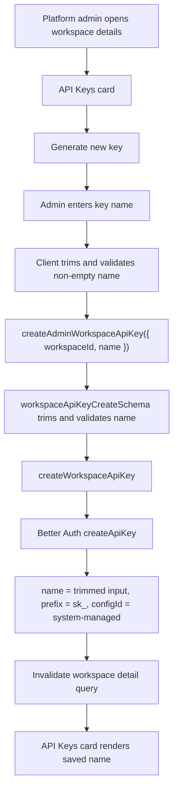

# Admin Workspace API Key Names Design

## Summary

Simplify the Admin Portal workspace-owned API key workflow so platform admins create exactly one kind of workspace-owned key, while providing a required human-readable key name.

The current implementation exposes an access-mode choice in the generate-key modal:

- `Read only`
- `Read and Write`

That distinction is unnecessary. The revised design removes `accessMode` from the UI, schema, server contract, and tests. The only operator-supplied field is the key name.

New keys use the `sk_` prefix and continue to use the existing Better Auth `system-managed` API key configuration.

## Problem

The Admin Portal currently makes platform admins choose between two workspace-owned API key types. That choice creates product and code complexity without a meaningful behavior difference in the current workspace API key verification path.

The visible symptoms are:

- the generate-key modal asks for access type
- the details page labels rows as `Read API Key` or `Read & Write API Key`
- the create schema accepts `accessMode`
- server code maps `accessMode` to key names and prefixes
- tests encode the two-type model

The desired product model is simpler:

- there is one workspace-owned API key type
- platform admins name keys so multiple keys can be distinguished operationally
- the key type itself is not selectable

## Goals

- Remove all `accessMode` usage from production code and tests.
- Remove the access-selection UI from the generate-key modal.
- Add a required key-name field to the generate-key modal.
- Trim the submitted key name before sending and storing it.
- Reject missing, empty, and whitespace-only key names.
- Enforce a maximum key-name length of 80 characters.
- Create new workspace-owned keys with prefix `sk_`.
- Store the admin-provided trimmed key name on the Better Auth API key record.
- Display the stored key name on the workspace details page.
- Use the stored key name in the delete confirmation dialog.
- Keep workspace ownership and `system-managed` scoping unchanged.

## Non-Goals

- Add multiple API key permission levels.
- Add read/write API permission enforcement.
- Migrate or preserve existing `sr_` or `srw_` database records.
- Backfill old key names.
- Change API key verification semantics.
- Change rate limits or Better Auth plugin configuration.
- Redesign the workspace details page beyond the API key modal and row labels.

## Current Architecture

The current Admin Portal workspace details surface lives under `apps/web`, because the admin experience is now merged into the web app.

Relevant source files:

- `apps/web/src/components/admin/admin-generate-workspace-api-key-dialog.tsx`
- `apps/web/src/components/admin/admin-workspace-api-keys-card.tsx`
- `apps/web/src/components/admin/admin-delete-workspace-api-key-dialog.tsx`
- `apps/web/src/admin/workspaces.schemas.ts`
- `apps/web/src/admin/workspaces.functions.ts`
- `apps/web/src/admin/workspaces.server.ts`
- `apps/web/src/api/api-key-verification.server.ts`
- `apps/web/src/auth/server/auth.server.ts`

Current key verification checks:

- the provided API key exists under `configId: "system-managed"`
- the key's `referenceId` matches the requested workspace ID
- Better Auth rate limiting is respected

Verification does not currently inspect `accessMode`, `name`, or prefix.

## Chosen Design

### Create Contract

The create input becomes:

```ts
{
  workspaceId: string;
  name: string;
}
```

The schema should:

- require `workspaceId`
- require `name`
- trim `name`
- reject an empty trimmed name
- reject names longer than 80 characters
- reject unknown create fields

The schema is the contract boundary. The UI can provide immediate feedback, but server validation must be authoritative.

### Generate-Key Modal

The modal keeps the existing dialog structure and explanatory copy, but replaces the access-mode radio group with a text input.

Recommended field:

- label: `Key name`
- `required`
- `maxLength={80}`
- placeholder: `Production support key`

Submit behavior:

- trim the input before mutation
- block submit if the trimmed value is empty
- show an inline validation message for empty or whitespace-only values
- call `createAdminWorkspaceApiKey({ data: { workspaceId, name } })`
- reset the field after successful creation
- continue invalidating `ADMIN_WORKSPACE_DETAIL_QUERY_KEY(workspaceId)` after success

This keeps the workflow lightweight while making the name meaningful metadata instead of a disguised permission type.

### Server Creation

Server creation remains workspace-owned:

- look up the workspace
- require a workspace owner user ID
- create the Better Auth key on behalf of the workspace owner
- set `organizationId` to the workspace ID
- set `configId` to `system-managed`
- set `name` to the validated trimmed name
- set `prefix` to `sk_`

The existing owner-user behavior is preserved because Better Auth organization-owned key creation still validates organization membership.

### Workspace Details Display

The key row should display the saved key name.

Fallback copy can remain defensive for malformed data:

- stored name present: render the stored name
- stored name missing: render `API Key`

With the clean database assumption and new validation, newly created keys should always have a name.

The row should continue to show:

- key start fragment when available
- `configId`
- created timestamp
- delete action

### Delete Confirmation

The delete dialog should use the stored key name for confirmation context.

Recommended copy:

```txt
This will permanently delete <key name>. The key belongs to the workspace and this hard delete cannot be undone.
```

Fallback copy can remain `this workspace API key` if the name is missing.

### Prefix And Compatibility

New keys use `sk_`.

No migration or backward compatibility work is required. The database will be flushed before relying on this behavior, so old `sr_` and `srw_` records do not need special handling.

## Data Flow



## Validation Rules

The key-name validation rules are:

- type: string
- trim whitespace
- minimum trimmed length: 1
- maximum trimmed length: 80

Examples:

| Input                     | Result                            |
| ------------------------- | --------------------------------- |
| `Enterprise onboarding`   | accepted                          |
| `  Staging support key  ` | accepted as `Staging support key` |
| ``                        | rejected                          |
| `   `                     | rejected                          |
| 81 characters             | rejected                          |

## Error Handling

Client-side validation should prevent the most common invalid submissions:

- empty name
- whitespace-only name
- over-length name through `maxLength`

Server-side validation remains authoritative:

- invalid schema input rejects before privileged server logic runs
- workspace not found still throws `Workspace not found.`
- workspace owner missing still throws `Workspace owner not found.`
- Better Auth errors are still unwrapped through the existing helper

## Testing Strategy

Focused tests should cover the contract, server behavior, and UI workflow:

- schema rejects unknown create fields
- schema trims valid names
- schema rejects empty and whitespace-only names
- schema rejects names longer than 80 characters
- server creates a key with `name` from input and `prefix: "sk_"`
- modal no longer renders radio buttons
- modal submits `{ workspaceId, name }`
- modal blocks whitespace-only names
- details card renders the stored key name
- delete dialog renders the stored key name
- E2E creates a named key and observes an `sk_` generated key

Targeted E2E is valuable because the original bug is visible in the admin modal and details page.

## Open Questions

None. The agreed decisions are:

- `accessMode` is fully removed.
- key name is required.
- key name is trimmed.
- key name max length is 80.
- newly generated keys use `sk_`.
- the saved key name is displayed in rows and delete confirmation.
- no migration or backward compatibility work is needed.
